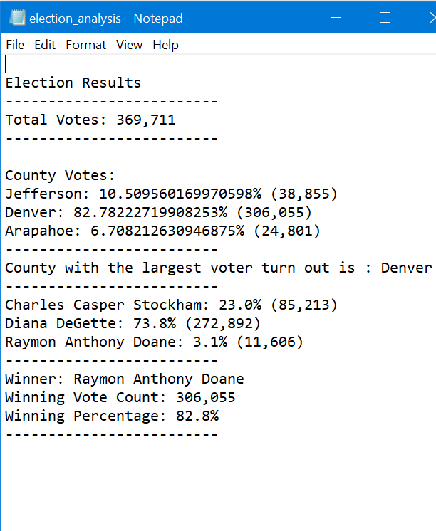

# Election_Analysis
VS Code with Python

# Overview
**Purpose
For our script, we needed to be able to output the following 

Total number of votes cast
A complete list of candidates who received votes
Total number of votes each candidate received
Percentage of votes each candidate won
The winner of the election based on popular vote

**Background
Using the csv file election_data.csv, we needed to extract, calcuate, and print the election information.

Results

Total Votes were based on total number of voters (unique ids)
Votes per County were measured by using the county name, calulating the percentage of votes cast divided by total number of votes
County with largest voter turnout was measured by extracting which county had the largest number of votes cast
Number of votes cast were extacting by counting the repetitions of each county 
Percentage of votes cast was calculated by using the total votes for that candidate divided by the total voters
Winning candidate was supposed to be measured by assessing total number of votes won for that candidate, along with highest percentage of votes per candidate

Summary
The script can be adjusted to used nation-wide because it is versitile enough to loop through unique candidates and counties. We can simply adjust those variables to reflect per state or city
